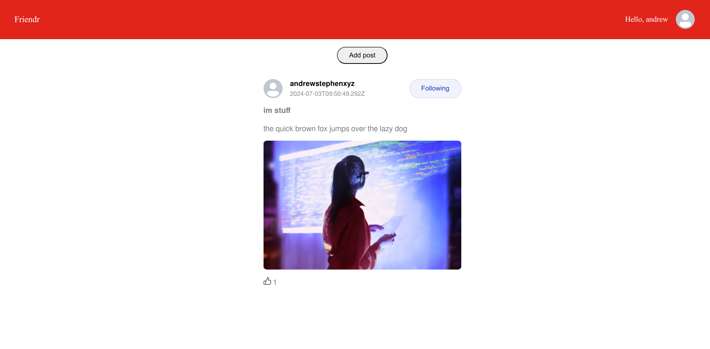

# Friendr

Friendr is a lightweight deployable social media webapp written in the MEAN stack.

# How to deploy

## Step 0: Requirements:
* [`git`](https://git-scm.com/downloads)
* [`docker`](https://www.docker.com/)

## Step 1: Clone the repository:

`git clone https://github.com/andrewstephengames/friendr`

`cd friendr`

## Step 2: Build the docker image:

`docker build -t friendr .`

## Step 3: Run the docker image:

`docker run -it -p 4200:4200 -p 3000:3000 friendr`

## Step 4: Open a browser and access http://localhost:4200
